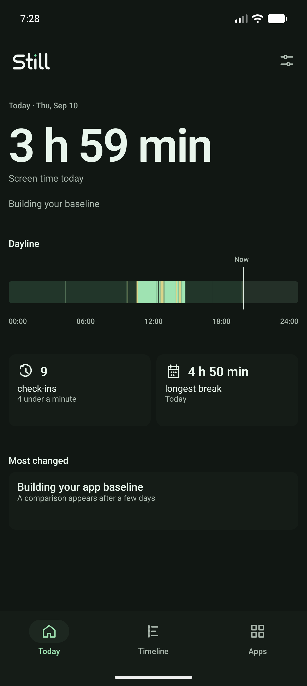
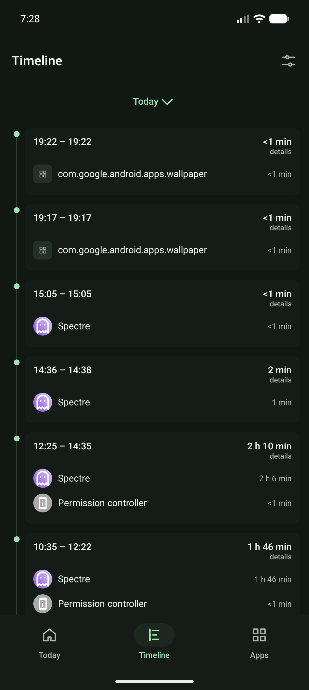
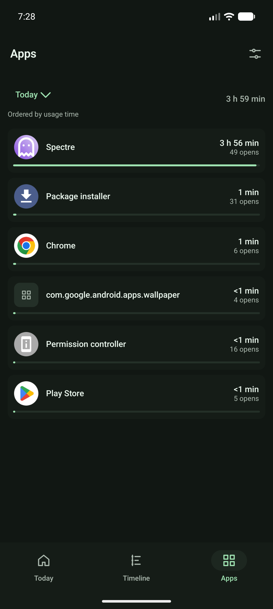
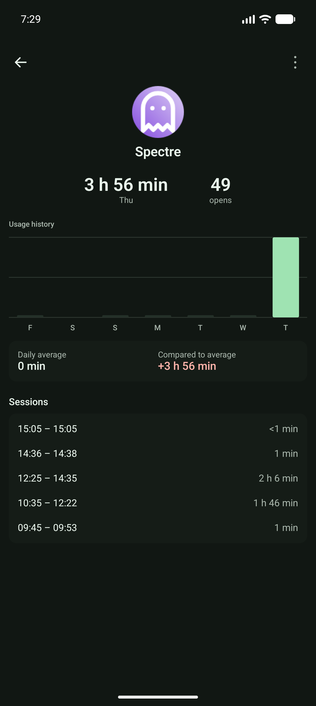

<p align="center">
  <picture>
    <source media="(prefers-color-scheme: dark)" srcset="branding/still_wordmark_inverse.svg">
    <source media="(prefers-color-scheme: light)" srcset="branding/still_wordmark.svg">
    
  </picture>
</p>

# Still

Still is a privacy-first Android screen-time app focused on understanding usage patterns without judgment. It reconstructs local usage events into phone sessions, app activity, check-ins, breaks, and same-time-of-day comparisons.

> Screen time without the guilt trip.

## Screenshots

<p align="center">
  
  
  
  
</p>

Captured from the connected Android emulator running Still 0.9.0 with Usage Access enabled. The values shown come from that emulator's local usage history.

## Features

- **Today** — current screen time, a same-time seven-day comparison, check-ins, quick checks, longest break, and one meaningful app change.
- **Dayline** — a compact timeline that makes fragmented use and longer sessions visually distinct.
- **Timeline** — reverse-chronological phone sessions with app duration, switch sequence, and day selection.
- **Apps** — selectable daily usage, opens, share of screen time, and per-app detail with usage history.
- **Statistics** — local trends across day, week, month, year, or a custom range, with neutral comparisons to the preceding period. Detailed rhythm metrics appear only for days with event history.
- **Compare with a friend** — exchange two QR codes in person to see a calm, side-by-side comparison without an account, server, or internet connection.
- **Appearance** — system, light, and dark themes, with optional Android 12+ wallpaper colors.
- **Local usage archive** — imports the oldest daily usage Android still retains, preserves detailed recent events in compressed form, and keeps the database on-device for long-term statistics.
- **Private history control** — explains what is stored and lets the user stop archival and delete Still's saved usage history at any time.

## Architecture

Still uses Kotlin, Jetpack Compose, Material 3, Navigation Compose, Coroutines/Flow, and DataStore Preferences. Platform event collection lives in `data/usage`, pure calculation code in `domain/analytics`, immutable models in `domain/model`, and screen-focused composables under `ui`.

Range calculations live in `domain/statistics` and read the existing local archive through `UsageRepository`. Detailed sessions and hourly patterns depend on the event data Android originally provided; aggregate-only days still contribute screen time, apps, and categories. Comparison snapshots are derived in `domain/compare`, encoded locally, and exchanged through QR codes using CameraX and ZXing.

`UsageStatsDataSource` converts Android `UsageEvents` into a small internal event model. `LocalUsageArchive` stores a shared app dictionary, compact daily app totals and a versioned, delta-encoded event stream that the app can rebuild into visible statistics. A native periodic job refreshes the archive twice daily. Pure Kotlin analyzers reconstruct foreground intervals, group real phone-use sessions, distinguish wakeups from unlocks, aggregate app use, build the Dayline, and calculate same-time baselines. ViewModels perform queries outside composition and expose stable UI state. The format and reconstruction path are documented in [`docs/DATA_ARCHIVE_FORMAT.md`](docs/DATA_ARCHIVE_FORMAT.md).

## Usage access

Android exposes usage statistics through `UsageStatsManager`. Still declares `android.permission.PACKAGE_USAGE_STATS`, but this is a special access—not a runtime permission dialog. Onboarding opens the system Usage Access screen and checks the actual AppOps state whenever Still resumes. Opening Settings alone never counts as permission approval.

## Privacy model

Still reads Android's local usage history and processes and archives it only on the device. The usage database is excluded from Android cloud backup and device transfer. Users can turn off **Save usage history** in Settings; confirming this deletes the archive and stops future archival while leaving current screen-time reads available.

The local usage archive contains app package names and labels; compact foreground, screen and keyguard transitions; and daily per-app durations and open counts. Daily screen time, unlocks, wakeups, sessions, quick checks, breaks, first/last use, hourly activity, and frequent app switches are rebuilt when needed instead of stored redundantly. Event streams use one-second timestamp deltas, variable-length integers, a package dictionary, and gzip compression.

DataStore keeps app preferences: onboarding completion, appearance, the last destination, widget configuration, update-check consent and channel, and postponed update reminders. A downloaded updater APK can temporarily exist in the app cache. Still contains no telemetry, advertisements, account system, or remote analytics SDK; its Internet permission is used only by the optional, consent-gated release updater.

Friend comparison uses only the camera permission. The first QR establishes a time cutoff when the selected range includes today, and the reply carries the same cutoff and session ID. QR codes contain only selected summary values, never raw events or the archive. Individual app labels are opt-in; package names are omitted. Received snapshots stay in the Compare ViewModel and disappear when that flow ends. Still does not verify that another person's values are tamper-proof.

## Build

Requirements:

- Android Studio with Android SDK 37 installed
- JDK 17

From the repository root:

```powershell
.\gradlew.bat testDebugUnitTest
.\gradlew.bat assembleDebug
```

Open the project in Android Studio, let Gradle sync, then run the `app` configuration on an API 28+ device or emulator. Grant Usage Access from Still's onboarding screen.

## Tests

Unit tests cover ordinary resume/pause pairs, app switching, duplicate resumes, missing pauses, screen-off boundaries, quick checks, longer sessions, unlock debouncing, midnight boundaries, same-time baseline calculations, and compressed event-archive round trips.

## Known Android and OEM limitations

Usage-event histories are provided by Android and can be incomplete on some devices. OEM power-management policies may delay events, launcher/system packages vary, and keyguard events are not equally reliable across every device. Still treats malformed sequences defensively, closes open foreground intervals at screen-off or query boundaries, filters only a small set of obvious system noise, and reports unavailable data instead of inventing statistics. App labels or icons can also be unavailable; in that case Still falls back to the package name and a text mark.
